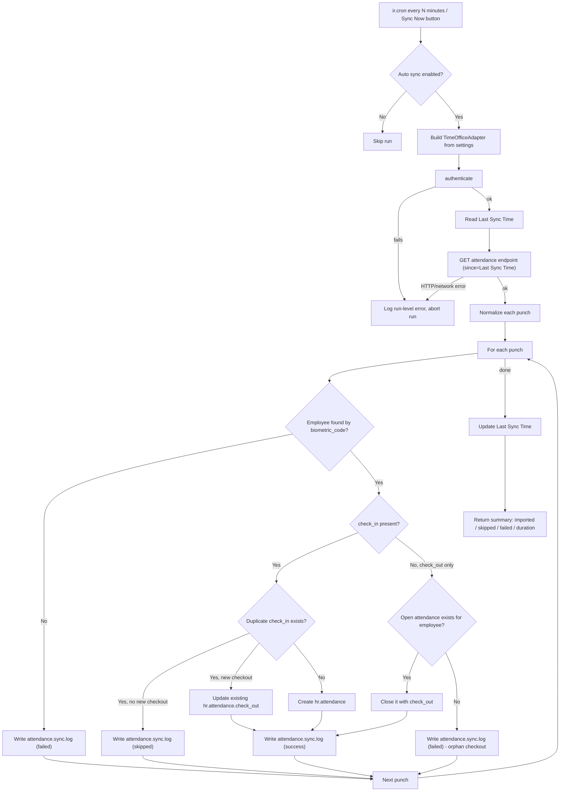

# Sync Flow Diagram

## High-level flow



## Per-punch decision logic (text form)

```
For each incoming punch:
  1. employee = find hr.employee by biometric_code == employee_code
     -> not found: log FAILED, continue to next punch (never stops the run)

  2. if check_in is present:
       existing = hr.attendance where employee_id = employee
                                  and check_in == punch.check_in
       - existing found, punch has a check_out and existing has none:
             update existing.check_out          -> log SUCCESS
       - existing found, nothing new:
             do nothing                          -> log SKIPPED (duplicate)
       - no existing:
             create hr.attendance(check_in, check_out?)
                                                  -> log SUCCESS

  3. elif check_out only (no check_in in this punch):
       open = latest hr.attendance where employee_id = employee
                                    and check_out is empty
       - open found: set open.check_out           -> log SUCCESS
       - none found: nothing to attach to          -> log FAILED (orphan checkout)

  4. Any unexpected exception while writing the record
     -> caught, logged as FAILED with the error, next punch continues.
```

This is how the module supports overnight shifts (an open
check-in from the previous evening gets its check-out from a punch
received the next morning), multiple punches per day (each check-in
starts its own `hr.attendance`), and missing checkouts (the record is
simply left open until a later sync closes it).
